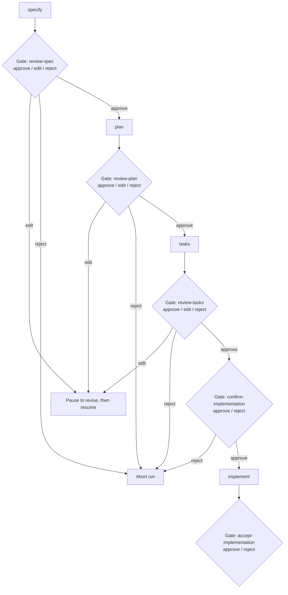

# Differences from Upstream (github/spec-kit)

This document outlines how this repository (**spec-kit-hitl**) differs from the upstream
[github/spec-kit](https://github.com/github/spec-kit).

The primary difference is the **Human-in-the-Loop (HITL) Framework**, which shifts the AI from
an autonomous builder into an analyst/advisor operating under direct human authority. For the
full design and component inventory, see [Human-in-the-Loop](human-in-the-loop.md).

---

## 1. Overview of Key Differences

| Area | Upstream (`github/spec-kit`) | This Fork (`spec-kit-hitl`) |
| :--- | :--- | :--- |
| **AI decision-making** | Autonomous; the agent fills gaps with "reasonable defaults" to keep the workflow moving. | Advisory; the agent generates options and a labeled recommendation, but the **human decides**. |
| **Governance** | Principles I–V (code quality, structure, UX, performance, dependencies). | Principles I–VI — adds **Principle VI: Human-in-the-Loop Authority (NON-NEGOTIABLE)**. |
| **Workflow gates** | 2 gates (`review-spec`, `review-plan`), each `[approve, reject]`; nothing between `tasks` and `implement`. | 5 gates: `review-spec` / `review-plan` / `review-tasks` (`[approve, edit, reject]`) plus a dedicated `confirm-implementation` authorization gate **before any code is written** and a final `accept-implementation` gate (`[approve, reject]`). |
| **Provenance tracking** | Assumptions listed without provenance. | Every material statement is tagged `[STATED]` / `[ASSUMED — confirm]` / `[PENDING DECISION]` / `[RECOMMENDATION]`. |
| **Decision auditing** | Plans record only the chosen design. | Plans carry a **Decision Points & Alternatives** table logging the options presented, their pros/cons/risks, and the human-chosen option. |
| **Agent-context enforcement** | Agent context file references the active plan. | The agent context file (and the `IntegrationBase` context block) additionally injects a **HITL Policy Enforcement** reminder pointing at `/memory/human-in-the-loop.md` (Principle VI). |
| **Research before options** | Local analysis only. | The agent is encouraged to scan the codebase, docs, and specs — and use web search where appropriate — to ground options *before* presenting them. |
| **Policy distribution** | n/a | Ships `templates/human-in-the-loop.md`, bundles it into the `core_pack`, and `specify init` seeds it to `.specify/memory/human-in-the-loop.md`. |

---

## 2. The mental-model shift

In upstream, the SDD (Spec-Driven Development) cycle is tuned for velocity: the agent makes
technical choices and self-corrects later.

In **spec-kit-hitl** the workflow prioritizes **safety, control, and auditability**:

- The agent is prohibited from defaulting its way from a short prompt to working code.
- Ambiguous scope, security/privacy, and auth gaps surface as `[PENDING DECISION]`, forcing a
  human choice rather than a silent default.
- CRITICAL technical decisions (tech stack, data store, project layout, testing approach) are
  presented in a structured matrix with pros/cons/risks and a *labeled recommendation* — and
  nothing is chosen until the human confirms.

---

## 3. Workflow gates & pause behavior

The bundled `speckit` workflow adds non-skippable gates that **pause** the executor (it does
not narrate and continue). Every gate has `on_reject: abort`.

- **`review-spec` / `review-plan` / `review-tasks`** offer an `edit` option: choosing `edit`
  pauses the run so you can revise the generated markdown by hand, then resume with
  `specify workflow resume <run_id>`.
- **`confirm-implementation`** is a new, explicit authorization checkpoint **before** the agent
  is permitted to write code or create implementation files. Nothing is written before it.
- **`accept-implementation`** is a post-run gate to explicitly accept or reject the output.
  (Rejection records the run as not accepted; it does not auto-revert files.)

> Upstream, by contrast, gates only `review-spec` and `review-plan` (`approve`/`reject`) and
> runs `tasks → implement` with no authorization checkpoint in between.

---

## 4. New files & operating documents

This repository introduces files and sections that do not exist upstream:

1. **[`.specify/memory/human-in-the-loop.md`](../../.specify/memory/human-in-the-loop.md)** —
   the operating policy: roles, decision-sensitivity tiers, Decision Point format, the
   Assumption Ledger, default-handling rules, and approval gates. The distributable source is
   [`templates/human-in-the-loop.md`](../../templates/human-in-the-loop.md).
2. **Principle VI** in [`.specify/memory/constitution.md`](../../.specify/memory/constitution.md)
   — *Human-in-the-Loop Authority (NON-NEGOTIABLE)*, with the full protocol delegated to the
   policy file.
3. **Per-command HITL Contract blocks** — every file in
   [`templates/commands/`](../../templates/commands/) embeds a self-sufficient
   *Human-in-the-Loop Contract* so the policy holds even if the standalone file is absent.
4. **Provenance tagging in templates** — specs from `templates/spec-template.md` distinguish
   what the user stated from what was assumed; plans from `templates/plan-template.md` add the
   **Decision Points & Alternatives** table and the Architecture Decision Gate.
5. **[Differences from Upstream](differences-from-upstream.md)** — this document.

For the full, enforced design and a component-by-component inventory, see
[Human-in-the-Loop](human-in-the-loop.md).
