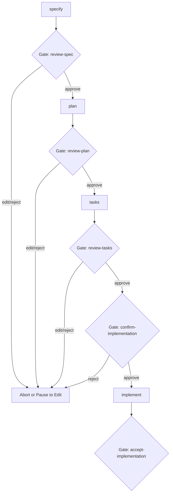

# Differences from Upstream (github/spec-kit)

This document outlines the differences between this repository (**spec-kit-hitl**) and the upstream [github/spec-kit](https://github.com/github/spec-kit). 

The primary difference lies in the **Human-in-the-Loop (HITL) Framework**, which shifts the AI from an autonomous builder to an analyst/advisor under direct human authority.

---

## 1. Overview of Key Differences

| Feature | Upstream (`github/spec-kit`) | This Fork (`spec-kit-hitl`) |
| :--- | :--- | :--- |
| **AI Decision Making** | Highly autonomous; AI fills gaps with "reasonable defaults" to keep workflow moving. | Advisory only; AI generates options and recommendations, but the human decides. |
| **Governance** | Principles I–V (Code quality, structure, UX, performance, dependencies). | Principles I–VI (adds **Principle VI: Human-in-the-Loop Authority**). |
| **Workflow Gates** | Two gates (`review-spec`, `review-plan`) with basic `[approve, reject]` options. | Five gates with `[approve, edit, reject]` choices, plus a pre-code authorization gate. |
| **Provenance Tracking** | Simple unchecked assumptions in specs. | Hard tagging on every assumption (`[STATED]`, `[ASSUMED — confirm]`, `[PENDING DECISION]`). |
| **Decision Auditing** | None; plans document only the chosen design. | **Decision Points & Alternatives** table logs presented options, pros/cons, and the chosen alternative. |
| **Commit Disclosure** | Standard git commits. | **Agent Attribution** (`Assisted-by: Spec Kit (autonomous)`) trailers added to all auto-commits. |
| **Research Requirement** | Local analysis only. | Mandated context scanning (codebase, documentation, specs) and external search (web) before proposing options. |

---

## 2. The Mental Model Shift

In the upstream repository, the SDD (Spec-Driven Development) cycle is designed for high velocity, relying on the agent to make technical choices and self-correct later. 

In **spec-kit-hitl**, the workflow prioritizes **safety, control, and auditability**:
* The agent is prohibited from defaulting its way from a short prompt to working code.
* Ambiguous scope boundaries are marked as `[PENDING DECISION]`, forcing a human choice.
* Technical decisions (tech stack, data store, project layout) must be presented in a structured matrix with pros/cons/risks.

---

## 3. Workflow Gates & Pause Behavior

The bundled `speckit` workflow has been heavily modified to include non-skippable gates that pause the executor:

* **`review-spec` / `review-plan` / `review-tasks`**: Now include an `edit` option. Choosing `edit` pauses the run so you can revise the generated markdown file manually, then resume using `specify workflow resume`.
* **`confirm-implementation`**: A new, explicit authorization checkpoint before the agent is permitted to write code or create implementation files.
* **`accept-implementation`**: A post-run gate to explicitly accept or reject the code output.

---

## 4. Documentation & Operating Files

This repository introduces several files and templates that do not exist upstream:

1. **[human-in-the-loop.md](file:///.specify/memory/human-in-the-loop.md)**: The operating policy containing the roles, sensitivity tiers, and formatting requirements for decision gates.
2. **[differences-from-upstream.md](file:///docs/concepts/differences-from-upstream.md)**: This comparison document.
3. **Provenance Tagging in Templates**:
   * Specs generated via `templates/spec-template.md` use tags to distinguish what the user stated vs. what was assumed.
   * Plans generated via `templates/plan-template.md` feature the **Decision Points & Alternatives** table and the **Architecture Decision Gate**.
